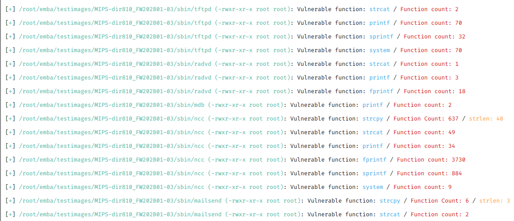
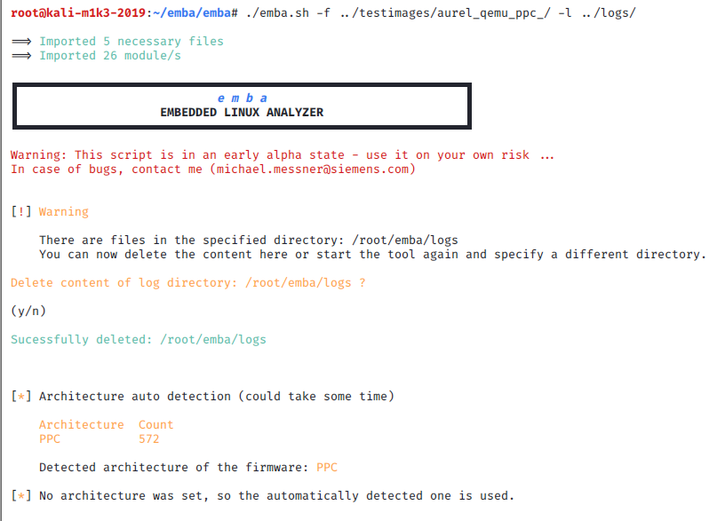

<!-- 
emba - EMBEDDED LINUX ANALYZER

Copyright 2020-2021 Siemens AG

emba comes with ABSOLUTELY NO WARRANTY. This is free software, and you are
welcome to redistribute it under the terms of the GNU General Public License.
See LICENSE file for usage of this software.

emba is licensed under GPLv3

Author(s): Michael Messner, Pascal Eckmann
-->
# emba, an analyzer for Linux-based firmware of embedded devices

<p align="center">
  
</p>
<p align="center">
  
</p>


### Why?

_emba_ is being developed as a firmware scanner that analyses already-extracted Linux-based firmware images. It should help you to identify and focus on the interesting areas of a huge firmware image.
Although _emba_ is optimized for offline firmware images, it can test both, live systems and extracted images. Additionally, it can also analyze kernel configurations.
_emba_ is designed to assist a penetration tester. It is not designed as a standalone tool without human interaction. _emba_ is designed to give as much information as possible about the firmware. The tester can decide on the areas to focus on and is always responsible for verifying and interpreting the results.



### How to use it?


__Before starting, check that all dependencies are met and use the installer.sh script:
`./emba.sh -d` or `./emba.sh -d -F`__

##### Arguments:  
```
Test firmware / live system
-a [MIPS]         Architecture of the linux firmware [MIPS, ARM, x86, x64, PPC]
-A [MIPS]         Force Architecture of the linux firmware [MIPS, ARM, x86, x64, PPC] (disable architecture check)
-l [./path]       Log path
-f [./path]       Firmware path
-e [./path]       Exclude paths from testing (multiple usage possible)
-m [MODULE_NO.]   Test only with set modules [e.g. -m p05 -m s10 ... ]]
                  (multiple usage possible, case insensitive, final modules aren't selectable, if firmware isn't a binary, the p modules won't run)
-c                Enable cwe-checker
-g                Create grep-able log file in [log_path]/fw_grep.log
                  Schematic: MESSAGE_TYPE;MODULE_NUMBER;SUB_MODULE_NUMBER;MESSAGE
-E                Enable automated qemu emulation tests (WARNING this module could harm your host!)
-D                Run emba in docker container
-i                Ignore log path check

Dependency check
-d                Only check dependencies
-F                Check dependencies but ignore errors

Special tests
-k [./config]     Kernel config path

Modify output
-s                Print only relative paths
-z                Add ANSI color codes to log

Help
-h                Print this help message
```

#### Docker Container
There is a simple docker-compose setup added which allows you to use emba in a docker container - [see the wiki for more details](https://github.com/e-m-b-a/emba/wiki/Docker-Container)

#### Examples

##### Static firmware testing:
- Extract the firmware from an update file or from flash storage with [binwalk](https://github.com/ReFirmLabs/binwalk) or something else
- Execute _emba_ with set parameters, e.g.
  
`sudo ./emba.sh -l ./logs/arm_test -f ./firmware/arm_firmware/`   



- Path for logs and firmware path are necessary for testing successfully (__WARNING:__ emba needs some free disk space for logging)
- Architecture will be detected automatically; you can overwrite it with `-a [ARCH]`
- Use `-A [ARCH]` if you don't want to use auto detection for architecture
- _emba_ currently supports the following architectures: MIPS, ARM, PPC, x86 and x64

##### Live testing:
For testing live system with _emba_ run it as if you were testing static firmware, but with `/` as firmware path:

`sudo ./emba.sh -l ./logs/local_test -f /`

- Path for logs and firmware path are necessary for testing successfully
- Architecture will be detected automatically; you can overwrite it with `-a [ARCH]`
- Use `-A [ARCH]` if you don't want to use auto detection for architecture
- The paths `/proc` and `/sys` will be automatically excluded
- It improves output and performance, if you exclude docker    
`-e /var/lib/docker`

##### Test kernel config:
Test only a kernel configuration with the kernel checker of [checksec](https://github.com/slimm609/checksec.sh):

`sudo ./emba.sh -l ./logs/kernel_conf -k ./kernel.config`

- If you add `-f ./firmware/x86_firmware/`, it will ignore `-k` and search for a kernel config inside
the firmware

__Good to know:__
- `sudo` is necessary for some modules to run properly
- Currently only tested on [Kali Linux](https://kali.org/downloads)(2020.4)
- _emba_ needs some free disk space for logging
- _emba_ uses well known tools like objdump, [LinEnum](https://github.com/rebootuser/LinEnum), [checksec](https://github.com/slimm609/checksec.sh), [linux-exploit-suggester.sh](https://github.com/mzet-/linux-exploit-suggester), [cwe-checker](https://github.com/fkie-cad/cwe_checker)
- _emba_ includes multiple modules of the well known Linux analyser [Lynis](https://cisofy.com/lynis/)

### Dependencies

_emba_ uses multiple other tools and components - [see the wiki for more details](https://github.com/e-m-b-a/emba/wiki/Dependencies)

### Structure

```
├── installer.sh
```
    
-> Tries to install all needed dependencies. Internet access for downloading is required.
  - Afterwards no Internet access is needed
```
├── check_project.sh
```
    
-> Check full project with all subdirectories with [shellchecker](https://github.com/koalaman/shellcheck)   
   - Install it on your system (Kali) with `apt-get install shellcheck`
```
├── emba.sh
```
-> Main script of this project
```
├── config
```
-> Configuration files for different modules with file names, regular expressions or paths. These files are very handy,
   easy to use and they also keep the modules clean.
```
├── external
```
-> All tools and files which are from other projects and necessary for _emba_
```
├── helpers
```
-> Some scripts for stuff like pretty formatting on your terminal or path handling
```
└── modules
```
-> The stars of the project - every module is an own file and will be called by [_emba_](/emba.sh). 

### External tools in directory 'external'
- ./yara
    - yara rule files - add your own rules here
- ./checksec
    - https://github.com/slimm609/checksec.sh
- ./linux-exploit-suggester.sh
    - https://github.com/mzet-/linux-exploit-suggester
- ./objdump with all architectures enabled
    - https://www.gnu.org/software/binutils/
- ./allitems.csv
    - Use the CSV formated vulnerability list from Mitre: https://cve.mitre.org/data/downloads/

### How to write own modules?
[See the wiki for more details](https://github.com/e-m-b-a/emba/wiki/How-to-write-own-modules)
